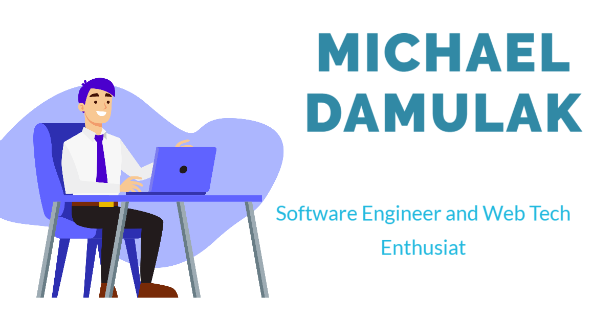

### Hi there, I am Michael Damulak 👋

I'm a software engineer who is passionate about the web and how it can improve lives, creating technology to redifine people, and building a community around that. Some technologies I enjoy working with include ReactJS, React and (React API's), Redux (for state managment), Ruby, Ruby on Rails,Javascript,PostgreSQL, HTML $ CSS . I love contributing to open source project and i am looking forward to geting a GitHub Star 🌟 based on my involvement in the tech community. My interest in the Web ecosystem led me to Microverse, a community of ### Remote Software Engineers. Using core web technologies stack and remote team culture(Remote Pair programming, code reviews) on a daily basis to build amazing tech for users and developers.

-🔭 I’m currently Open to Remote Work with great team culture.
 🌱 I’m currently learning Front-end Tech such as (Angular)
 👯 I’m looking to collaborate on a decentralized co-operative system for employee
 
### TECH STACK

## 📫 How to reach me: ...
- 😄 Pronouns: ...
- ⚡ Fun fact: Apart from my well known coding addiction, I love traveling an exploring the world! #DigitalNormad

